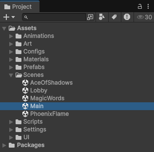
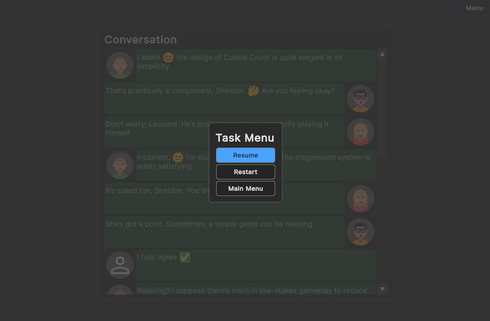
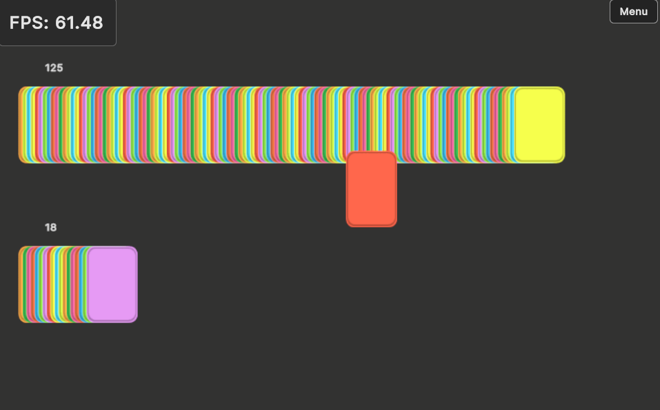
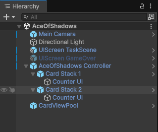
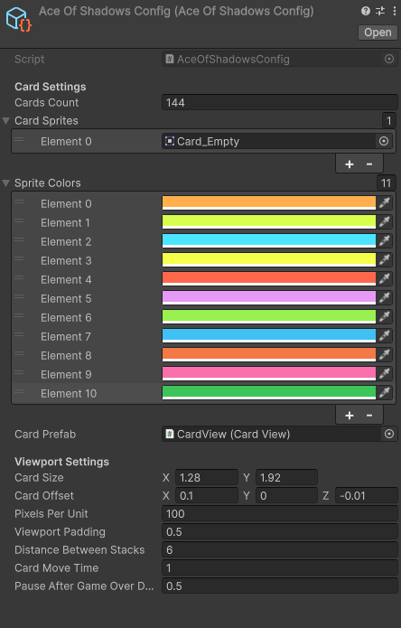
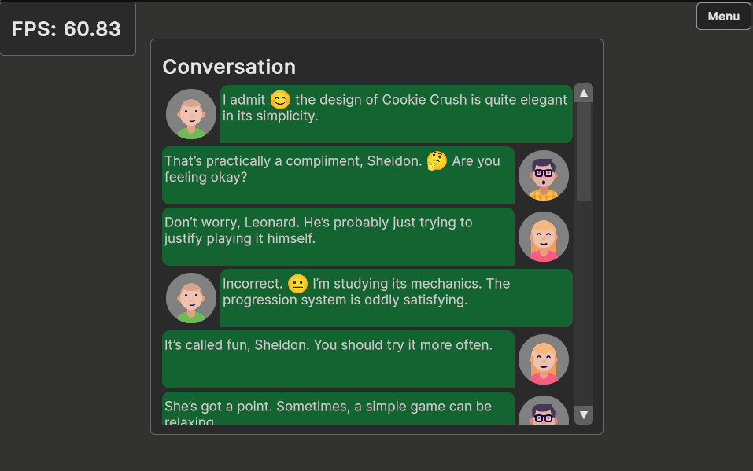
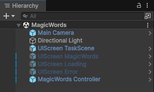
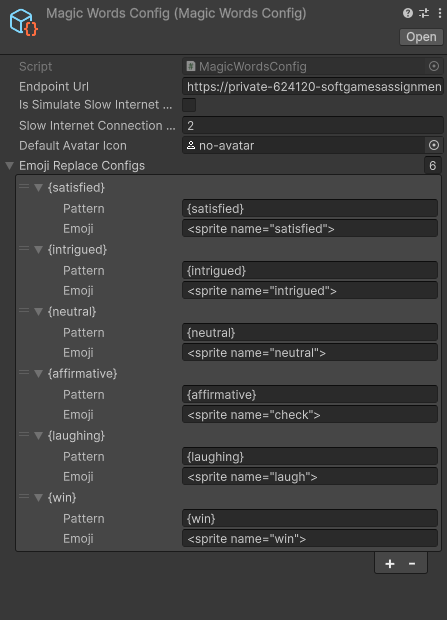
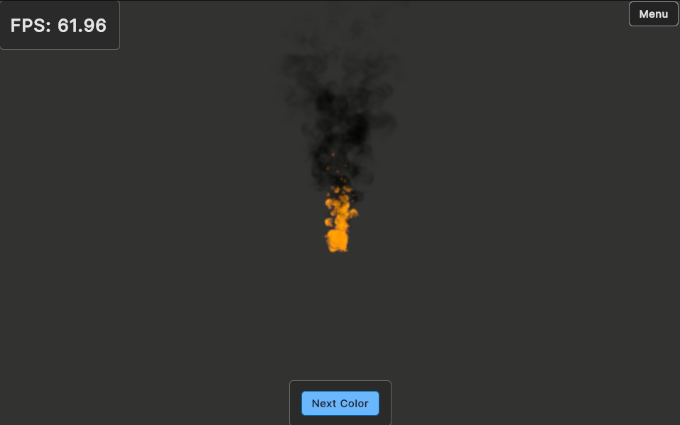
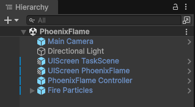

# Softgames Assignment – Unity Project

This repository contains my solution for the Softgames assignment, implemented in Unity with a strong focus on clean architecture, runtime UI separation, and extensibility.

> The project consists of three independent tasks, unified by a common runtime UI Toolkit framework, scene navigation system, and shared UI patterns.

## Unity Version & Platform

* Unity: 6.2.1

* Render Pipeline: `URP`

* Target Platform: `WebGL`

* Hosting: `GitHub Pages` [Play in browser](https://www.freewebtime.com/softgames/)

## Getting Started

1. Open project in Unity Editor
2. Navigate to `Scenes/Main`
3. Press `Play`
4. Enjoy

## Project Structure Overview

The project is split into five scenes, each with a clear responsibility:



|Scene|	Description|
|:----------- | -------------:|
| Main | App bootstrap scene (FPS counter, target frame rate setup)|
| Lobby | Main menu / task selection |
| AceOfShadows | Task 1 implementation |
| MagicWords| Task 2 implementation |
| PhoenixFlame | Task 3 implementation |

> Scene navigation is handled entirely through UI events and scene loading.

## Runtime UI Architecture (`UI Toolkit`)

All UI in this project is implemented using UI Toolkit at runtime, following a data-driven ViewData pattern.

### Core Concepts

Each UI screen in the scene consists of:

A `UIDocument` (renders the UI Toolkit document)

A `UIScreen_{ScreenName}` MonoBehaviour

* The `UIScreen`:

    * Holds a ViewData instance
    * Assigns it as `dataSource` to the root VisualElement
    * Controls screen visibility (`Show()` / `Hide()`)

UIScreen Base Class
```csharp
class UIScreen<TViewData>
```

Generic base class for all screens

Provides:

* Show / Hide logic
* Get / Set ViewData
* Ensures strong typing per screen

### ViewData System

All UI data objects:

* Inherit from a common `ViewData` base class
* Are marked with `[Serializable]`
* Can be configured directly in the Inspector

The base `ViewData`:

* Implements `IDataSourceViewHashProvider`
* Exposes `CommitChanges()`, which increments an internal version number

> This version change triggers UI Toolkit rebinding and repainting.

### Property Update Pattern

Each bindable property:

* Has a backing field
* Checks if the value actually changed
* Calls `CommitChanges()` only if needed

This ensures:

* No unnecessary UI refreshes
* Predictable, explicit updates

### Example: `Main Menu UI`


`MainMenuViewData` contains:

```csharp
string Title

List<UIButtonViewData> Buttons
```

Each `UIButtonViewData` contains:

```csharp
string Text

UnityEvent OnClick
```

Buttons are bound in UI Toolkit and invoke their `OnClick` events when pressed.

In the Inspector, these events are wired to:

```csharp
MainMenuScreen.LoadScene(string sceneName)
```

This pattern is used consistently across the entire project.

### Common In-Game Menu (All Task Scenes)



Each task scene includes a shared Task Scene UI Screen with:

* A menu button (top-right corner)
* A centered in-game menu with:
    * Resume – hides menu
    * Restart – reloads current scene
    * Main Menu – loads Lobby scene

This ensures consistent navigation across all tasks.

## Task 1 – Ace of Shadows



### Scene Objects:



* MainCamera (CameraController)
* AceOfShadowsController
* CardViewPool
* UIScreen TaskScene
* UIScreen GameOver
* Two CardStack objects

### Configuration



### Card Pooling

`CardViewPool`:

* Uses DontDestroyOnLoad
* Reuses card objects across scene reloads
* Ensures only one pool instance exists at any time

Cards are taken from the pool or instantiated if needed.

### Gameplay Flow

1. On Start():
    * Cards are instantiated via a coroutine
    * Cards are pushed into Card Stack 1
    * Optional frame-by-frame instantiation for visual clarity

2. Gameplay coroutine:
    * Cards are popped from Stack 1
    * Smoothly moved to Stack 2
    * Sorting order is temporarily increased during movement
    * Cards are re-parented to Stack 2 on arrival

3. UI Updates:
    * Each `CardStack` has a Cards Counter UI Screen
    * Stack size changes immediately update the UI via ViewData

4. Game Over:

    * After last card transfer
    * Optional delay from config
    * <b>Game Over screen</b> appears with:
        * Restart
        * Main Menu

## Task 2 – Magic Words



### Scene Objects:



* `MagicWordsController`
* UI Screens:
    * TaskScene
    * Loading
    * Error
    * MagicWords (Conversation UI)

### Configuration



### Data Loading Flow

1. JSON is downloaded from a configured URL
2. JSON is deserialized into DTOs:
    * ConversationDTO
    * DialogueLineDTO
    * AvatarDTO

> DTOs strictly match the JSON structure.

### ViewData Mapping

`MagicWordsViewData` contains:

```csharp 
string Title

List<DialogueLineViewData>

Dictionary<string, AvatarViewData> Avatars
```

Each `DialogueLineViewData` references an `AvatarViewData` instance.

Initially:

* Avatars use a placeholder texture

### Progressive Avatar Loading

After UI is shown:

* Avatar images are loaded asynchronously
* On success → texture is assigned and UI updates instantly
* On failure → error is logged, placeholder remains

Optional slow-internet simulation:
* Configurable delay after JSON load
* Configurable delay per avatar texture

## Task 3 – Phoenix Flame



### Scene Objects



* PhoenixFlameController
* PhoenixFlameParticles
* Fire Particle System (+ smoke child)
* UI Screens:
    * TaskScene
    * PhoenixFlame

### Interaction Flow

* UI contains a single Next Color button
* Button triggers:

```csharp
PhoenixFlameController.NextColor()
```

This calls:

```csharp
PhoenixFlameParticles.NextColor()
```

Which:
* Updates an Animator parameter
* Drives particle emission color changes exactly as described in the task

## Key Design Principles

* Clear separation between UI, data, and logic
* No direct UI manipulation from gameplay code
* UI updates driven entirely by ViewData changes
* Minimal coupling between systems
* Consistent patterns across all tasks

## Notes

* WebGL build exceeds 50 MB due to assets and runtime UI Toolkit
* Project is designed to be easily extensible with additional screens or tasks

## Author

Jack Sidorenko